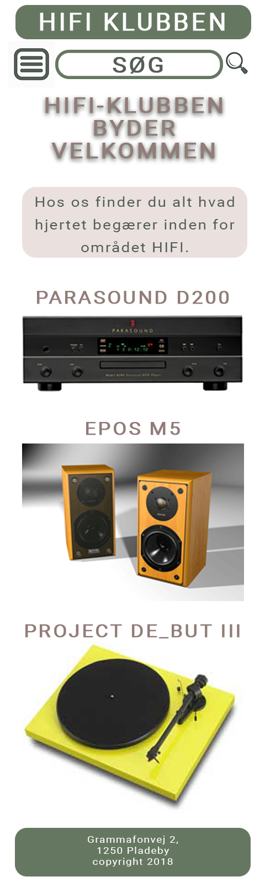
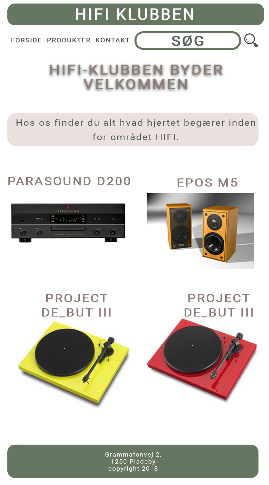
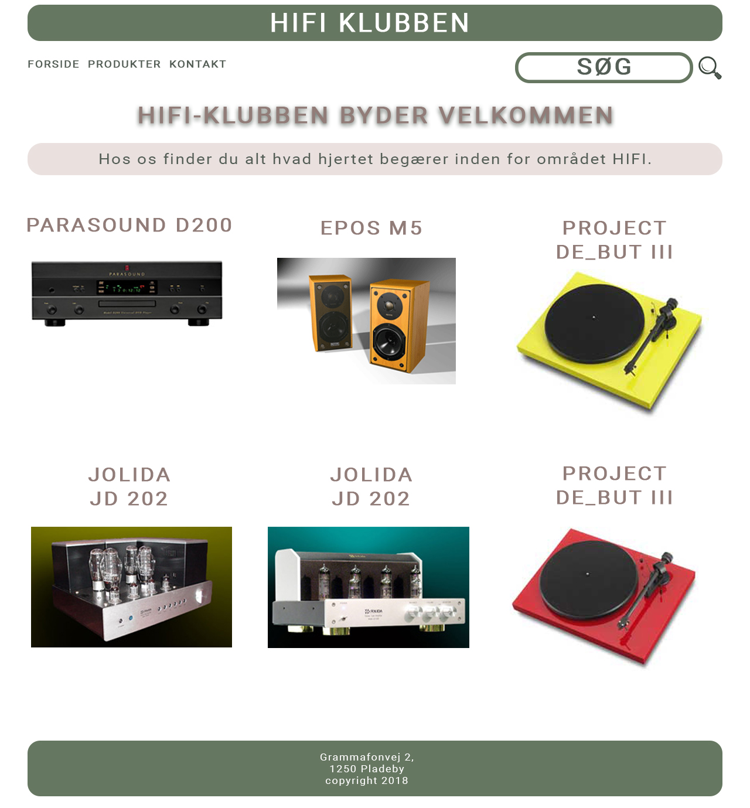
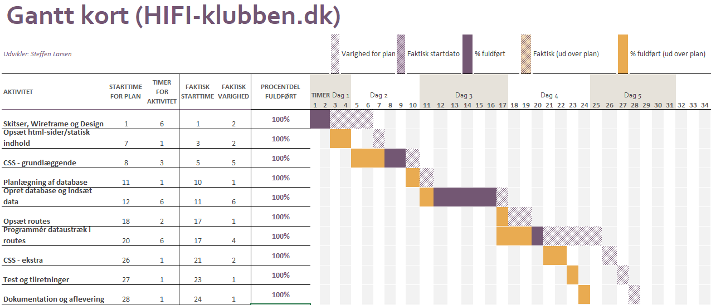

# Dokumentation HIFI-klubben

## Projekt HIFI klubben
Web applikationen er til fremvisning af HIFI klubbens produkter, hvor du kan søge manuelt og via kategorier. Kontakt HIFI klubben direkte igennem applikationen via kontaktformularen.

## Features

- Produktlister
- Søgefunktion
- links til kategorier
- kontaktformular

## Installation
Installer de tilhørende pakker via `npm install`, importer sql databasen fra projektets root. Husk at ændre indstillinger i `.env-filen`.

  
## Contribute

Source code : [hifi-klubben-sleran](https://github.com/rts-cmk-wi83/hifi-klubben-sleran)

Issue tracker : [Issues solve, github:HIFI-klubben](https://github.com/rts-cmk-wi83/hifi-klubben-sleran/issues)

## Support
Har du problemer med at køre applikationen. Kontakt mig [5072357@RTS-365.dk](5072357@RTS-365.dk) 
 

## Wireframe

## Design

### Mobil

### Tablet

### Desktop

## Tidsforbrug

## Diagram database

